<picture>
  <source media="(prefers-color-scheme: dark)" srcset="./assets/profile-banner-dark.svg">
  <source media="(prefers-color-scheme: light)" srcset="./assets/profile-banner-light.svg">
  
</picture>

 

**윤혁준 · Backend & Platform Engineer**

신뢰할 수 있는 시스템, 명확한 API 경계, 운영하기 좋은 개발 도구를 만듭니다. 
I build reliable systems, clear boundaries, and practical tools for developers.

  
  
  

## What I build

<table>
  <tr>
    <td width="50%" valign="top">
      <h3><a href="https://github.com/devy1540/toard">toard</a></h3>
      
Claude Code, Codex 등 AI 코딩 도구의 사용량과 비용을 한곳에서 추적하는 오픈소스·셀프호스팅 플랫폼입니다.

      TypeScript · Rust · PostgreSQL · Kubernetes
    </td>
    <td width="50%" valign="top">
      <h3><a href="https://github.com/devy1540/fcp">FCP</a></h3>
      
실제 AWS·Google Cloud SDK를 그대로 연결해 로컬 개발과 통합 테스트에 사용하는 경량 클라우드 에뮬레이터입니다.

      Go · AWS · Google Cloud · Protocol emulation
    </td>
  </tr>
  <tr>
    <td width="50%" valign="top">
      <h3><a href="https://github.com/devy1540/ltm-wiki">LTM Wiki</a></h3>
      
세션과 도구에 종속되지 않는 사용자 소유 Markdown 기반 AI 에이전트 장기기억 저장소입니다.

      TypeScript · Markdown · Codex · Claude Code
    </td>
    <td width="50%" valign="top">
      <h3><a href="https://github.com/devy1540/claude-pulse">Claude Pulse</a></h3>
      
컨텍스트, 비용, 출력 속도와 도구 활동을 실시간으로 보여주는 빠르고 가벼운 Claude Code 상태표시줄입니다.

      Rust · Single binary · Developer experience
    </td>
  </tr>
  <tr>
    <td width="50%" valign="top">
      <h3><a href="https://github.com/devy1540/devy1540.github.io">Devy Archive</a></h3>
      
백엔드 아키텍처와 운영 경험을 기록하는 hydrated SSG 기반 기술 블로그입니다.

      React · TypeScript · Vite · GitHub Pages
    </td>
    <td width="50%" valign="top">
      <h3><a href="https://github.com/devy1540/jvm-concurrency-benchmark">JVM Concurrency Benchmark</a></h3>
      
Platform Thread, Virtual Thread, Kotlin Coroutine의 동시성 특성을 같은 시나리오에서 비교합니다.

      Java · Kotlin · Spring Boot · Prometheus
    </td>
  </tr>
</table>

## Engineering notes

- **Auth & Security** — [JWT HS256 → RS256/JWKS/KMS](https://devy1540.dev/posts/jwt-hs256-to-rs256-jwks-kms/) · [Backend-owned login flow](https://devy1540.dev/posts/auth-authorize-callback-flow/)
- **JVM Runtime** — [Thread vs Virtual Thread vs Coroutine](https://devy1540.dev/posts/sync-virtual-coroutine-benchmark/) · [JDK 21 → 25 migration](https://devy1540.dev/posts/jdk-migration-strategy-21-to-25/)
- **Platform** — [ECS → EKS migration](https://devy1540.dev/posts/ecs-to-eks-migration/) · [LGTM stack on EKS](https://devy1540.dev/posts/lgtm-stack-setup-guide/)
- **Observability** — [Datadog → LGTM](https://devy1540.dev/posts/lgtm-stack-observability/) · [API response & error standardization](https://devy1540.dev/posts/api-response-error-standardization/)

## Toolbox

  
  
  
  
  
  
  
  
  
  
  
  

## Contribution trail

  <picture>
    <source media="(prefers-color-scheme: dark)" srcset="https://raw.githubusercontent.com/devy1540/devy1540/output/github-snake-dark.svg">
    <source media="(prefers-color-scheme: light)" srcset="https://raw.githubusercontent.com/devy1540/devy1540/output/github-snake.svg">
    
  </picture>

Profile banner is generated from [`scripts/generate_profile_banner.py`](./scripts/generate_profile_banner.py) and supports light, dark, and reduced-motion preferences.
