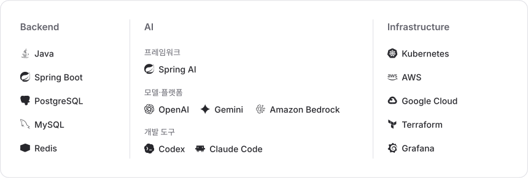

  <picture>
    <source media="(prefers-color-scheme: dark)" srcset="./assets/profile-hero-dark.svg" />
    <source media="(prefers-color-scheme: light)" srcset="./assets/profile-hero-light.svg" />
    
  </picture>

  <picture>
    <source media="(max-width: 600px) and (prefers-color-scheme: dark)" srcset="./assets/profile-tech-stack-mobile-dark.svg" />
    <source media="(max-width: 600px)" srcset="./assets/profile-tech-stack-mobile-light.svg" />
    <source media="(prefers-color-scheme: dark)" srcset="./assets/profile-tech-stack-dark.svg" />
    
  </picture>

