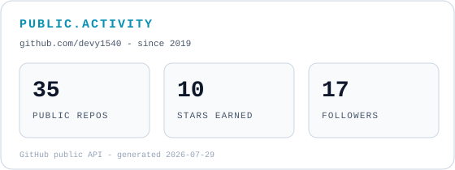
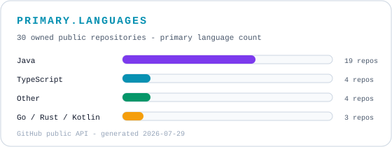

<!-- Theme-aware terminal banner -->
<picture>
  <source media="(prefers-color-scheme: dark)" srcset="./dark.svg">
  <source media="(prefers-color-scheme: light)" srcset="./light.svg">
  
</picture>

<!-- GitHub activity -->

  <picture>
    <source media="(prefers-color-scheme: dark)" srcset="https://streak-stats.demolab.com/?user=devy1540&amp;hide_border=true&amp;background=0A101F&amp;stroke=22D3EE&amp;ring=A78BFA&amp;fire=10B981&amp;currStreakLabel=22D3EE&amp;sideLabels=94A3B8&amp;currStreakNum=F8FAFC&amp;sideNums=F8FAFC&amp;dates=64748B&amp;titleColor=22D3EE&amp;card_width=1180">
    
  </picture>
   
  <picture>
    <source media="(prefers-color-scheme: dark)" srcset="./stats-dark.svg">
    <source media="(prefers-color-scheme: light)" srcset="./stats-light.svg">
    
  </picture>
  <picture>
    <source media="(prefers-color-scheme: dark)" srcset="./languages-dark.svg">
    <source media="(prefers-color-scheme: light)" srcset="./languages-light.svg">
    
  </picture>

<!-- Contribution snake. The output branch is created by .github/workflows/snake.yml. -->

  <picture>
    <source media="(prefers-color-scheme: dark)" srcset="https://raw.githubusercontent.com/devy1540/devy1540/output/github-snake-dark.svg">
    <source media="(prefers-color-scheme: light)" srcset="https://raw.githubusercontent.com/devy1540/devy1540/output/github-snake.svg">
    
  </picture>

 

<!-- Selected public projects -->

  

 

<!-- Public links -->

  

