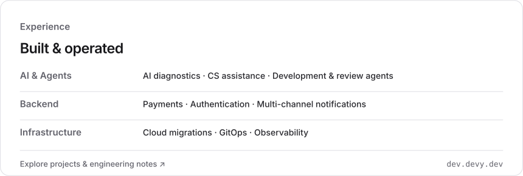

  <picture>
    <source media="(prefers-color-scheme: dark)" srcset="./assets/profile-hero-dark.svg" />
    <source media="(prefers-color-scheme: light)" srcset="./assets/profile-hero-light.svg" />
    
  </picture>

  <a href="https://dev.devy.dev/about/" title="기술 스택과 관련 경험 보기">
    <picture>
      <source media="(max-width: 600px) and (prefers-color-scheme: dark)" srcset="./assets/profile-tech-stack-mobile-dark.svg" />
      <source media="(max-width: 600px)" srcset="./assets/profile-tech-stack-mobile-light.svg" />
      <source media="(prefers-color-scheme: dark)" srcset="./assets/profile-tech-stack-dark.svg" />
      
    </picture>
  </a>

  <a href="https://dev.devy.dev/about/">
    <picture>
      <source media="(max-width: 600px) and (prefers-color-scheme: dark)" srcset="./assets/profile-experience-mobile-dark.svg" />
      <source media="(max-width: 600px)" srcset="./assets/profile-experience-mobile-light.svg" />
      <source media="(prefers-color-scheme: dark)" srcset="./assets/profile-experience-dark.svg" />
      
    </picture>
  </a>

